# Study Pal Architecture Diagrams

## Diagram 1: LangGraph Workflow State Machine


## Diagram 2: RAG Pipeline Architecture

```mermaid
graph LR
    subgraph "Document Ingestion"
        PDF[📄 PDF Upload] --> PROCESSOR[Document Processor<br/>PyPDFLoader]
        PROCESSOR --> CHUNKER[Text Chunking<br/>size=1000, overlap=200]
        CHUNKER --> CHUNKS[Text Chunks<br/>e.g., 42 chunks]
    end

    subgraph "Embedding & Storage"
        CHUNKS --> EMBEDDER[OpenAI Embeddings<br/>text-embedding-3-small<br/>1536 dimensions]
        EMBEDDER --> VECTORS[Vector Embeddings]
        VECTORS --> CHROMA[(ChromaDB Collection<br/>materials-user_id)]
    end

    subgraph "Retrieval & Generation"
        QUERY[🔍 User Query] --> EMBED_Q[Embed Query]
        EMBED_Q --> CHROMA
        CHROMA --> SEARCH[Similarity Search<br/>cosine distance]
        SEARCH --> TOP_K[Top-5 Chunks<br/>scores: 0.95, 0.89, 0.87...]
        TOP_K --> CONTEXT[Build Context Window]
        CONTEXT --> LLM[GPT-4o-mini<br/>with strict prompt]
        LLM --> RESPONSE[✅ Tutor Response<br/>context-only, no hallucination]
    end

    style PDF fill:#EF4444,stroke:#B91C1C,color:#fff
    style CHROMA fill:#8B5CF6,stroke:#6D28D9,color:#fff
    style LLM fill:#3B82F6,stroke:#1E40AF,color:#fff
    style RESPONSE fill:#10B981,stroke:#047857,color:#fff
```



## Diagram 3: Multi-Agent State Sharing

```mermaid
graph TB
    subgraph "StudyPalState - Shared Memory"
        STATE[🗂️ State Dictionary<br/>TypedDict with 25+ fields]

        STATE --> MESSAGES[messages: list[BaseMessage]<br/>with add_messages reducer]
        STATE --> INTENT[current_intent: tutor/scheduler/analyzer/motivator]
        STATE --> FLAGS[Session Flags<br/>tutor_session_active<br/>awaiting_schedule_confirmation<br/>awaiting_schedule_details]
        STATE --> ANALYSIS[analysis_results: SessionRecommendations<br/>weak_points, priority_topics]
        STATE --> SCHEDULE[generated_schedule: dict<br/>Pomodoro plan]
        STATE --> PROFILE[user_profile: dict<br/>persona, goals, traits]
    end

    subgraph "Agents - Read & Write State"
        ROUTER_AGENT[Intent Router<br/>Writes: current_intent, next_agent]
        TUTOR_AGENT[Tutor Agent<br/>Writes: tutor_session_active<br/>Reads: messages]
        ANALYZER_AGENT[Analyzer Agent<br/>Writes: analysis_results, weak_points<br/>Sets: awaiting_schedule_confirmation]
        SCHEDULER_AGENT[Scheduler Agent<br/>Reads: weak_points<br/>Writes: generated_schedule]
        MOTIVATOR_AGENT[Motivator Agent<br/>Reads: user_profile<br/>Appends: messages]
    end

    STATE -.->|read/write| ROUTER_AGENT
    STATE -.->|read/write| TUTOR_AGENT
    STATE -.->|read/write| ANALYZER_AGENT
    STATE -.->|read/write| SCHEDULER_AGENT
    STATE -.->|read/write| MOTIVATOR_AGENT

    ROUTER_AGENT -->|next_agent decision| TUTOR_AGENT
    TUTOR_AGENT -->|exit detected| ANALYZER_AGENT
    ANALYZER_AGENT -->|weak points| SCHEDULER_AGENT
    SCHEDULER_AGENT -->|schedule created| MOTIVATOR_AGENT

    style STATE fill:#F59E0B,stroke:#B45309,color:#000
    style ROUTER_AGENT fill:#6B7280,stroke:#374151,color:#fff
    style TUTOR_AGENT fill:#3B82F6,stroke:#1E40AF,color:#fff
    style ANALYZER_AGENT fill:#10B981,stroke:#047857,color:#fff
    style SCHEDULER_AGENT fill:#F59E0B,stroke:#B45309,color:#fff
    style MOTIVATOR_AGENT fill:#8B5CF6,stroke:#6D28D9,color:#fff
```

## Diagram 4: Weakness Detection Flow


## Diagram 5: Per-User RAG Isolation

```mermaid
graph TB
    subgraph "User A Session"
        USER_A[👤 User: alice] --> CHATBOT_A[LangGraphChatbot<br/>user_id: alice]
        CHATBOT_A --> RAG_A[RAG Pipeline<br/>collection: materials-alice]
        RAG_A --> CHROMA_A[(ChromaDB<br/>Collection: materials-alice<br/>42 chunks)]
    end

    subgraph "User B Session"
        USER_B[👤 User: bob] --> CHATBOT_B[LangGraphChatbot<br/>user_id: bob]
        CHATBOT_B --> RAG_B[RAG Pipeline<br/>collection: materials-bob]
        RAG_B --> CHROMA_B[(ChromaDB<br/>Collection: materials-bob<br/>18 chunks)]
    end

    subgraph "User C Session"
        USER_C[👤 User: carol] --> CHATBOT_C[LangGraphChatbot<br/>user_id: carol]
        CHATBOT_C --> RAG_C[RAG Pipeline<br/>collection: materials-carol]
        RAG_C --> CHROMA_C[(ChromaDB<br/>Collection: materials-carol<br/>67 chunks)]
    end

    subgraph "Global Singleton Pattern"
        FACTORY[get_rag_pipeline factory<br/>_rag_pipeline_instances dict]
        SANITIZE[_sanitize_collection_name<br/>Ensures 3-512 alphanumeric chars]
    end

    CHATBOT_A -.->|requests RAG| FACTORY
    CHATBOT_B -.->|requests RAG| FACTORY
    CHATBOT_C -.->|requests RAG| FACTORY

    FACTORY -->|sanitize user_id| SANITIZE
    SANITIZE -->|returns clean name| FACTORY
    FACTORY -.->|alice| RAG_A
    FACTORY -.->|bob| RAG_B
    FACTORY -.->|carol| RAG_C

    style USER_A fill:#3B82F6,stroke:#1E40AF,color:#fff
    style USER_B fill:#10B981,stroke:#047857,color:#fff
    style USER_C fill:#8B5CF6,stroke:#6D28D9,color:#fff
    style CHROMA_A fill:#3B82F6,stroke:#1E40AF,color:#fff
    style CHROMA_B fill:#10B981,stroke:#047857,color:#fff
    style CHROMA_C fill:#8B5CF6,stroke:#6D28D9,color:#fff
    style FACTORY fill:#F59E0B,stroke:#B45309,color:#000
```



## Diagram 6: Exit Intent Detection Logic


## Diagram 7: Scheduler Weak Point Prioritization

```mermaid
flowchart LR
    subgraph "Input: Analysis Results"
        WEAK_POINTS[Weak Points List<br/>from Analyzer]

        SEVERE[🔴 derivatives<br/>difficulty: severe<br/>frequency: 5]
        MODERATE1[🟡 integrals<br/>difficulty: moderate<br/>frequency: 3]
        MODERATE2[🟡 limits<br/>difficulty: moderate<br/>frequency: 2]
        MILD[🟢 notation<br/>difficulty: mild<br/>frequency: 1]

        WEAK_POINTS --> SEVERE
        WEAK_POINTS --> MODERATE1
        WEAK_POINTS --> MODERATE2
        WEAK_POINTS --> MILD
    end

    subgraph "Prioritization Logic"
        SORT[_prioritize_weak_topics]

        SORT --> TIER1[Tier 1: Severe topics]
        SORT --> TIER2[Tier 2: Moderate topics]
        SORT --> TIER3[Tier 3: Mild topics]
        SORT --> TIER4[Tier 4: User-specified topics]
    end

    subgraph "Output: Pomodoro Schedule"
        SCHEDULE[Generated Schedule]

        BLOCK1[18:00-18:25<br/>📚 Study: derivatives]
        BREAK1[18:25-18:30<br/>☕ Break]
        BLOCK2[18:30-18:55<br/>📚 Study: derivatives]
        BREAK2[18:55-19:00<br/>☕ Break]
        BLOCK3[19:00-19:25<br/>📚 Study: integrals]
        BREAK3[19:25-19:30<br/>☕ Break]
        BLOCK4[19:30-19:55<br/>📚 Study: limits]

        SCHEDULE --> BLOCK1
        BLOCK1 --> BREAK1
        BREAK1 --> BLOCK2
        BLOCK2 --> BREAK2
        BREAK2 --> BLOCK3
        BLOCK3 --> BREAK3
        BREAK3 --> BLOCK4
    end

    SEVERE -->|Priority 1| SORT
    MODERATE1 -->|Priority 2| SORT
    MODERATE2 -->|Priority 3| SORT
    MILD -->|Priority 4| SORT

    TIER1 -.->|Allocate most time| BLOCK1
    TIER1 -.->|Allocate most time| BLOCK2
    TIER2 -.->|Medium allocation| BLOCK3
    TIER3 -.->|Light touch| BLOCK4

    style SEVERE fill:#EF4444,stroke:#B91C1C,color:#fff
    style MODERATE1 fill:#F59E0B,stroke:#B45309,color:#000
    style MODERATE2 fill:#F59E0B,stroke:#B45309,color:#000
    style MILD fill:#10B981,stroke:#047857,color:#fff
    style SORT fill:#8B5CF6,stroke:#6D28D9,color:#fff
    style BLOCK1 fill:#EF4444,stroke:#B91C1C,color:#fff
    style BLOCK2 fill:#EF4444,stroke:#B91C1C,color:#fff
    style BLOCK3 fill:#F59E0B,stroke:#B45309,color:#000
    style BLOCK4 fill:#10B981,stroke:#047857,color:#fff
```



---

## How to Use These Diagrams

### For Presentation Slides:
1. Copy the Mermaid code into [Mermaid Live Editor](https://mermaid.live)
2. Export as SVG or PNG (high resolution for slides)
3. Use Diagram 1 (LangGraph Workflow) as your main architecture slide
4. Use Diagram 2 (RAG Pipeline) to explain hallucination prevention
5. Use Diagram 3 (State Sharing) to explain agent collaboration

### For Video Demo:
- Show Diagram 1 while explaining "How does the system route between agents?"
- Show Diagram 4 (Weakness Detection) when demoing session analysis
- Show Diagram 7 (Scheduler Prioritization) when creating study schedules

### For README/Documentation:
- Include Diagram 1 in the main architecture section
- Link to this file for detailed diagrams
- Use Diagram 5 (User Isolation) to explain multi-tenancy

---

## Technical Notes

**Color Coding Legend:**
- 🔵 Blue (#3B82F6): Tutor Agent / LLM operations
- 🟢 Green (#10B981): Analyzer Agent / Success states
- 🟡 Orange (#F59E0B): Scheduler Agent / Warning states
- 🟣 Purple (#8B5CF6): Motivator Agent / Profile operations
- ⚫ Gray (#6B7280): Intent Router / Neutral states
- 🔴 Red (#EF4444): Critical decisions / Severe weak points

**Diagram Formats:**
- All diagrams are in Mermaid syntax (widely supported)
- Can be embedded directly in GitHub/GitLab Markdown
- Compatible with Obsidian, Notion, Confluence
- Export to SVG/PNG for presentations
