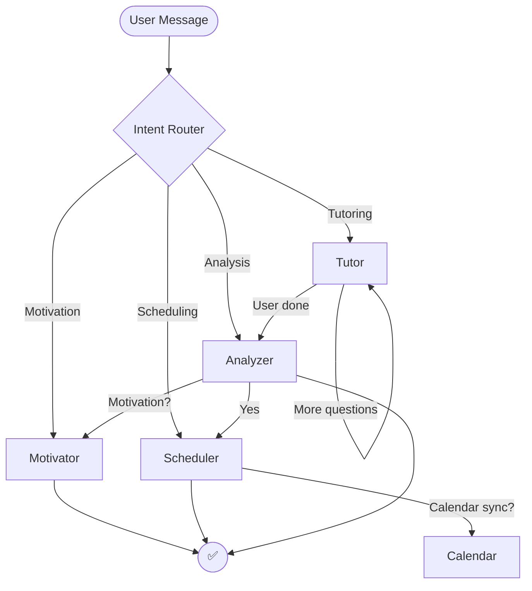

# Study Pal – AI-Driven Multimodal Study Companion

Study Pal is your autonomous study mentor, capable of planning lessons, delivering personalized tutoring, tracking comprehension, and keeping motivation high. Built on LangGraph, modern LLMs, and a multi-agent architecture, it operates like a full learning team in your pocket.

---

## 🚀 Why Study Pal Stands Out

- **Agentic Intelligence** – LangGraph orchestrates specialized agents that collaborate to plan, teach, analyze, and motivate.
- **Adaptive RAG Tutoring** – Every explanation comes from your personal knowledge base—no hallucinations, just targeted instruction.
- **Post-Session Intelligence** – Each session ends with AI-generated weakness analysis and prompts to schedule the next one.
- **GPT-4o-Class Performance** – Executes end-to-end study sessions—tutoring, assessments, motivation, scheduling—without manual intervention.

---

## 🧠 Architecture Overview

### Core Agents

| Agent | Role | Key Highlights |
|-------|------|----------------|
| **Intent Router** | Entry point | Classifies requests as tutoring, scheduling, analysis, or motivation. |
| **Tutor Agent** | Active session guide | Uses RAG, adapts tone, quizzes, and explanations to the user level. |
| **Analyzer Agent** | Post-session analyst | Summaries, highlights strengths/weaknesses, tracks learning objectives, saves results to state. |
| **Scheduler Agent** | Next-step planner | Suggests future sessions aligned with weaknesses & availability, integrates with calendar. |
| **Motivator Agent** | Emotional closer | Delivers customized motivational messages in the user’s preferred persona. |

---

## 🔁 Workflow Breakdown



### Session Flow

1. Untangle user intent.
2. Start tutoring session with contextual teaching.
3. Detect when the user is done.
4. Run post-session analysis and offer scheduling.
5. Add motivational message in user’s preferred voice.

---

## 🛠️ What Powers It All

### Tech Stack

| Layer | Technology | Contribution |
|-------|------------|--------------|
| **LangGraph** | Agent orchestration | State machine and scheduling logic. |
| **LangChain** | Chain of thought | Structured calls to OpenAI. |
| **OpenAI GPT-4o-mini** | Generative core | Tutoring, routing, analysis messaging. |
| **Custom RAG Pipeline** | ChromaDB + embedding models | User-curated knowledge retrieval. |
| **Gradio UI** | Interactive shell | Visual chat interface with real-time feedback. |
| **Python** | Core language | Structuring the app and agents. |
| **Scheduler Agent** | LangGraph node | Turns availability and analysis into Pomodoro plans. |
| **Motivator Agent** | Personality layer | Pulls profile data and AI-generated motivational messaging. |
| **Logging** | Python logging + Gradio | Observability and session history. |

---

## 🗂️ Repo Structure

```
study_pal/
├── agents/
│   ├── tutor_agent.py              # RAG tutoring capabilities
│   ├── scheduler_agent.py          # Availability analysis & Pomodoro planner
│   ├── motivator_agent.py          # Persona-driven motivation messages
│   ├── weakness_detector_agent.py  # Post-session analysis
│   └── user_profile.py             # Persona & motivational context store
├── core/
│   ├── workflow_graph.py           # LangGraph graph definition
│   ├── workflow_nodes.py           # Intent router + agent node functions
│   ├── workflow_state.py           # Shared state schema
│   ├── langgraph_chatbot.py        # Chatbot wrapper around the graph
│   ├── rag_pipeline.py             # Retrieval pipeline with ChromaDB
│   └── mcp_connectors.py           # Calendar + external service connectors
├── data/profiles/                  # Saved user personas (gitignored)
├── gradio_app.py                   # Web UI entry point
├── test_gradio.py                  # Local test harness
├── logs/                           # Runtime logs
├── requirements.txt                # Dependencies
└── README.md
```

---

## 👩‍🏫 Agent Role Deep Dive

| Agent | Workflow Stage | Inputs | Outputs | Why It Matters |
|-------|----------------|--------|---------|----------------|
| Intent Router | Always on | Latest user message | `next_agent` | Seamless transitions across multi-agent graph. |
| Tutor Agent | During sessions | User question + RAG context | Answers, quizzes, reflections | Ensures learning stays aligned to uploaded material. |
| Analyzer Agent | After sessions | Transcript, state facts | Summary, weakness map, scheduling prompt | Encourages reflection and next steps. |
| Scheduler Agent | Opt-in | Availability prompt, weak points | Actionable Pomodoro plan | Converts feedback into commitment. |
| Motivator Agent | Contextual | User profile | Persona-aligned motivation | Sustains user engagement. |

---

## 🛠️ Getting Started

### Prerequisites

- Python 3.10+
- OpenAI API Key
- (Optional) Calendar MCP endpoint credentials

### Install & Launch

```bash
git clone https://github.com/<your-handle>/study_pal.git
cd study_pal

python -m venv .venv
source .venv/bin/activate          # Windows: .venv\Scripts\activate
pip install -r requirements.txt

export OPENAI_API_KEY=sk-...       # add to .env for convenience
python gradio_app.py               # launch the UI
```

---

## 🧪 Demo Script (Recruiter Ready)

1. **Upload materials** – Drop a PDF in Gradio; watch chunks count update.
2. **Kick off tutoring** – “Walk me through support vector machines.”
3. **Dig deeper** – Request a quiz, answer, and get grading feedback.
4. **End session** – “Thanks, I’m done. Analyze my studying.”
5. **Accept scheduling offer** – Respond “Yes” → provide “Wednesday 18:00-20:00.”
6. **Sync calendar** – Confirm with “Yes” when prompted.
7. **Ask for hype** – “Give me a pep talk.”

Watch the terminal logs to narrate LangGraph’s hand-offs in real time.

---

## 🛡️ Security & Privacy

- Every user/session gets isolated Chroma collections and LangGraph state.
- No cross-contamination: materials, analyses, schedules stay scoped to the user.
- Analyzer outputs live only in session state unless exported.
- Graceful degradation if external services (calendar, quotes) are unavailable.

---

## 🔮 Roadmap Highlights

- **Memory + Reinforcement** – Track skill progression across sessions.
- **Voice Mode** – Speech-to-text input and persona-based text-to-speech output.
- **Curriculum Builder** – Multi-day study journey generation.
- **Analytics Dashboard** – Visualize study streaks, topic mastery, motivation trends.
- **LLM-Routed Intent** – Replace keyword heuristics with few-shot router chains.

---

## 🙋‍♂️ About the Maker

Crafted by an AI systems engineer obsessed with turning LLM theory into working products. Experienced with agent orchestration, retrieval intelligence, LangGraph, and human-in-the-loop design. If your team wants to ship agentic, multimodal AI systems, let’s talk.

---

**Study Pal** is more than a chatbot—it’s a modular, agentic coaching platform showcasing best practices in modern LLM engineering. Use it to prove you can architect, build, and ship intelligent, production-ready AI experiences.***
