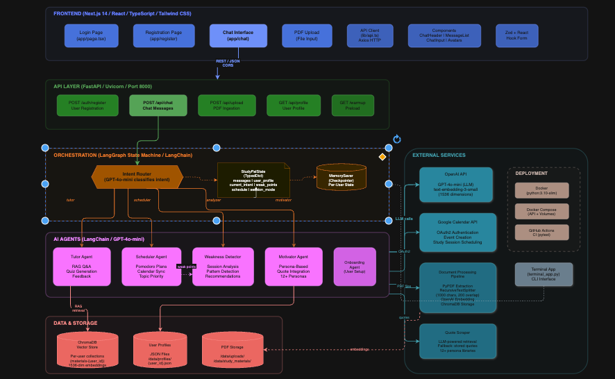

# Study Pal – AI-Driven Multimodal Study Companion

[](https://www.python.org/downloads/)
[](https://opensource.org/licenses/MIT)
[](https://github.com/langchain-ai/langgraph)
[](https://fastapi.tiangolo.com/)
[](https://nextjs.org/)
[](https://www.trychroma.com/)
[](https://github.com/rom812/study-pal/actions)

**Quick Start:** `./scripts/start_dev.sh` → open http://localhost:3000 (see [Quick Start](docs/quick-start.md))

<div align="center">
  <video src="data/demo_1.5x.mp4" width="80%" autoplay muted loop>
    Your browser does not support the video tag.
  </video>
</div>

Study Pal is your autonomous study mentor: it plans lessons, delivers personalized tutoring, tracks comprehension, and keeps motivation high. Built on **LangGraph**, modern LLMs, and a **multi-agent architecture**, it works like a full learning team in your pocket.

---

## Table of Contents

- [Why Study Pal Stands Out](#-why-study-pal-stands-out)
- [Architecture Overview](#-architecture-overview)
- [Workflow](#-workflow)
- [Tech Stack](#-tech-stack)
- [Entry Points & How to Run](#-entry-points--how-to-run)
- [Repository Structure](#-repository-structure)
- [Environment Variables](#-environment-variables)
- [Agent Roles](#-agent-roles)
- [Demo Script](#-demo-script-recruiter-ready)
- [Development & Testing](#-development--testing)
- [Documentation](#-documentation)
- [Security & Privacy](#-security--privacy)
- [Roadmap](#-roadmap)
- [About](#-about)

---

## Why Study Pal Stands Out

- **Agentic intelligence** – LangGraph orchestrates specialized agents that collaborate to plan, teach, analyze, and motivate.
- **Adaptive RAG tutoring** – Explanations are grounded in your uploaded materials; the system minimizes hallucination and stays on-topic.
- **Post-session intelligence** – Sessions can end with AI-generated weakness analysis and prompts to schedule the next one.
- **GPT-4o-class performance** – End-to-end flows (tutoring, analysis, motivation, scheduling) run without manual switching.

---

## Architecture Overview

<div align="center">
  
  <br /><em>System Architecture Diagram</em>
</div>

<br />

Study Pal is a **full-stack, multi-agent AI system** built across six interconnected layers:

1. **Frontend (Next.js 14)** — A React/TypeScript chat UI with Tailwind CSS. Includes a login page, registration, chat interface, PDF upload, and reusable components (ChatHeader, MessageList, ChatInput, Avatars). Communicates with the backend over REST/JSON with CORS.

2. **API Layer (FastAPI / Uvicorn)** — Exposes five main endpoints: user registration (`POST /auth/register`), chat messaging (`POST /api/chat`), PDF ingestion (`POST /api/upload`), user profile retrieval (`GET /api/profile`), and a preload warmup route (`GET /warmup`).

3. **Orchestration (LangGraph State Machine)** — The brain of the system. An **Intent Router** (GPT-4o-mini) classifies each user message and routes it to the appropriate agent. Shared state is managed through a `StudyPalState` TypedDict (messages, user profile, current intent, weak points, schedule, session mode) with a `MemorySaver` checkpointer for per-user state persistence.

4. **AI Agents (LangChain / GPT-4o-mini)** — Five specialized agents handle different concerns:
   - **Tutor Agent** — RAG-powered Q&A, quiz generation, and feedback grounded in uploaded materials.
   - **Scheduler Agent** — Pomodoro-style study plans with topic priority and optional Google Calendar sync.
   - **Weakness Detector** — Session analysis, pattern detection, and study recommendations from transcripts.
   - **Motivator Agent** — Persona-based motivational messages drawing from 12+ persona quote libraries.
   - **Onboarding Agent** — Interactive first-run user setup (persona, field, goals).

5. **External Services** — OpenAI API (GPT-4o-mini for LLM, text-embedding-3-small for 1536-dim embeddings), Google Calendar API (OAuth2 for event creation and study session scheduling), a document processing pipeline (PyPDF extraction → RecursiveTextSplitter → OpenAI embeddings → ChromaDB storage), and an LLM-powered quote scraper with fallback to stored persona libraries.

6. **Data & Storage** — ChromaDB vector store with per-user collections and 1536-dimension embeddings, JSON-based user profiles (`/data/profiles/{user_id}.json`), and file storage for uploaded PDFs and study materials (`/data/uploads/`, `/data/study_materials/`).

**Deployment** options include Docker (python:3.10-slim), Docker Compose (API + volumes), GitHub Actions CI (pytest), and a terminal CLI (`terminal_app.py`).

### Core Agents

| Agent | Role | Highlights |
|-------|------|------------|
| **Intent Router** | Entry point | LLM-based classification: tutoring, scheduling, analysis, or motivation. |
| **Tutor Agent** | Active session | RAG-powered Q&A, quizzes, explanations; adapts to user level. |
| **Analyzer Agent** | Post-session | Summaries, strengths/weaknesses, learning objectives; writes to shared state. |
| **Weakness Detector** | Deep analysis | Identifies specific knowledge gaps and weak points from session transcripts. |
| **Scheduler Agent** | Planning | Suggests Pomodoro-style sessions from weak points and availability; optional Google Calendar sync. |
| **Motivator Agent** | Engagement | Persona-aligned motivational messages using user profile and scraped/generated quotes. |
| **Onboarding Agent** | First-run setup | Interactive questionnaire: persona selection (e.g. Feynman, Kobe), academic field, goals, pain points. |
| **Quote Scraper / Generator** | Content | LLM-powered quote retrieval + personalized motivational message generation per user profile. |

Orchestration lives in **LangGraph**: one state machine, one entry (Intent Router), conditional edges to the right agent. Shared state is a `TypedDict` (`StudyPalState`) with message history, session flags, analysis/schedule data, and user profile context. See [Architecture](docs/architecture.md) for detailed diagrams.

---

## Workflow


### Session flow (high level)

1. **Intent** – Classify the user message (tutor / scheduler / analyzer / motivator).
2. **Tutoring** – Answer questions with RAG over uploaded materials; support quizzes and follow-ups.
3. **Wrap-up** – When the user is done, run the Analyzer for summary and weak points.
4. **Scheduling** – Optionally suggest and create a study plan; optionally sync to calendar (e.g. MCP).
5. **Motivation** – Deliver a persona-aligned motivational message when requested.

---

## Tech Stack

### Backend & AI

| Layer | Technology | Version / Details |
|-------|------------|-------------------|
| **Orchestration** | [LangGraph](https://github.com/langchain-ai/langgraph) | ≥ 0.2 · State machine with nodes, conditional edges, checkpointer |
| **LLM Framework** | [LangChain](https://www.langchain.com/) | ≥ 0.3 · Chains, prompts, output parsers |
| **LLM Provider** | [OpenAI](https://platform.openai.com/) (GPT-4o-mini) | ≥ 1.30 · Tutoring, routing, analysis, motivation, quote generation |
| **Embeddings** | OpenAI `text-embedding-3-large` | Configurable via `configs/settings.yaml` |
| **Vector Store** | [ChromaDB](https://www.trychroma.com/) | ≥ 0.4 · Per-user collections for RAG retrieval |
| **Vector Store (alt)** | [Pinecone](https://www.pinecone.io/) | ≥ 3.0 · Optional cloud-based vector store |
| **API Server** | [FastAPI](https://fastapi.tiangolo.com/) + [Uvicorn](https://www.uvicorn.org/) | ≥ 0.115 / ≥ 0.30 · REST API with async support |
| **Data Validation** | [Pydantic](https://docs.pydantic.dev/) | ≥ 2.5 · Request/response models, state typing |
| **PDF Processing** | [pypdf](https://pypdf.readthedocs.io/) | ≥ 3.17 · Extract text from uploaded study materials |
| **Tokenization** | [tiktoken](https://github.com/openai/tiktoken) | ≥ 0.5 · Token counting for context window management |
| **HTTP Client** | [httpx](https://www.python-httpx.org/) | ≥ 0.25 · Async HTTP requests |
| **Calendar** | Google Calendar API | Direct integration via `google-api-python-client` |
| **Calendar MCP** | `@cocal/google-calendar-mcp` | Node.js 20 · Optional MCP server for calendar sync |
| **Config** | [python-dotenv](https://github.com/theskumar/python-dotenv) + YAML | `.env` for secrets, `configs/settings.yaml` for app settings |
| **Testing** | [pytest](https://docs.pytest.org/) | ≥ 7.4 · 20+ test files covering agents, RAG, calendar, onboarding |

### Frontend

| Layer | Technology | Version / Details |
|-------|------------|-------------------|
| **Framework** | [Next.js](https://nextjs.org/) | 14.2 · App Router, SSR |
| **UI Library** | [React](https://react.dev/) | 18.3 · Component-based UI |
| **Language** | [TypeScript](https://www.typescriptlang.org/) | 5.5 · Type-safe frontend code |
| **Styling** | [Tailwind CSS](https://tailwindcss.com/) | 3.4 · Utility-first CSS framework |
| **CSS Processing** | [PostCSS](https://postcss.org/) + [Autoprefixer](https://github.com/postcss/autoprefixer) | CSS transforms and vendor prefixes |
| **HTTP Client** | [Axios](https://axios-http.com/) | 1.7 · API communication with backend |
| **Form Handling** | [React Hook Form](https://react-hook-form.com/) + [Zod](https://zod.dev/) | 7.53 / 3.23 · Validated forms (registration, settings) |
| **Icons** | [Lucide React](https://lucide.dev/) | 0.427 · Modern icon library |
| **Build Tool** | [SWC](https://swc.rs/) | Rust-based fast compiler for Next.js |
| **Linting** | [ESLint](https://eslint.org/) | 8.57 · Code quality enforcement |

### Infrastructure & DevOps

| Layer | Technology | Details |
|-------|------------|------|
| **Containers** | [Docker](https://www.docker.com/) + [Docker Compose](https://docs.docker.com/compose/) | Python 3.10-slim base; one-command API deployment |
| **CI/CD** | [GitHub Actions](https://github.com/features/actions) | Automated pytest on push/PR to `main` |
| **CLI** | Python | Full multi-agent graph in the terminal (`terminal_app.py`) |

---

## Entry Points & How to Run

Study Pal has **three** ways to run. There is **no Gradio**; UIs are **Terminal** and **Web (FastAPI + Next.js)**.

### Prerequisites

- **Python 3.10+**
- **OpenAI API key** (required)
- **Node.js 18+** (only for Web UI)
- Optional: Calendar MCP or other external service credentials (see [Environment variables](#-environment-variables))

### Option A – Terminal UI (full graph)

Best for trying the full multi-agent flow locally.

```bash
git clone https://github.com/<your-handle>/study_pal.git
cd study_pal
python -m venv .venv
source .venv/bin/activate   # Windows: .venv\Scripts\activate
pip install -r requirements.txt
export OPENAI_API_KEY=sk-...   # or use .env
python terminal_app.py
```

Use the terminal chat; you can say `upload` and provide materials, then ask questions, request analysis, scheduling, or a pep talk.

### Option B – Web UI (API + Next.js)

Full graph behind a web chat, registration, and file upload.

1. **Backend:** `api/` (FastAPI)  
2. **Frontend:** `frontend/` (Next.js)  
3. **Quick start:** See **[Quick Start](docs/quick-start.md)** for step-by-step setup (e.g. `./scripts/start_dev.sh` or running API and frontend separately).

After setup:

- **Frontend:** http://localhost:3000  
- **API:** http://localhost:8000  
- **API docs:** http://localhost:8000/docs  

### Option C – Tutor-only demo

RAG + Tutor agent only; no full graph (no Analyzer/Scheduler/Motivator).

```bash
pip install -r requirements.txt
export OPENAI_API_KEY=sk-...
python main.py
```

Useful for testing the RAG pipeline and Tutor in isolation.

### Option D – Run with Docker

One-command API (requires `OPENAI_API_KEY` in `.env` or environment):

```bash
# Build and run API only
docker-compose up --build

# API at http://localhost:8000
# Frontend: run separately with ./start_dev.sh or see DEPLOY.md
```

See [Deployment](docs/deployment.md) for full deployment options.

---

## Repository Structure

```
study_pal/
├── agents/                        # Agent implementations
│   ├── tutor_agent.py             # RAG-powered tutoring & quizzes
│   ├── tutor_chatbot.py           # Extended tutor chatbot interface
│   ├── scheduler_agent.py         # Pomodoro study plans + Google Calendar sync
│   ├── motivator_agent.py         # Persona-based motivational messages
│   ├── weakness_detector_agent.py # Knowledge gap analysis from transcripts
│   ├── onboarding.py              # Interactive user onboarding questionnaire
│   ├── user_profile.py            # User profile / persona handling & storage
│   ├── quote_scraper.py           # LLM-powered quote retrieval & personalization
│   └── quote_store.py             # Quote persistence and retrieval
├── api/                           # FastAPI backend (Web UI)
│   ├── main.py                    # REST API: chat, upload, profile endpoints
│   ├── requirements.txt           # API-specific deps (FastAPI, Uvicorn, etc.)
│   └── run.sh                     # Quick-start script for API server
├── core/                          # Graph orchestration, state, RAG
│   ├── workflow_graph.py          # LangGraph graph definition & compilation
│   ├── workflow_nodes.py          # Intent router + all agent node functions
│   ├── workflow_state.py          # StudyPalState TypedDict (shared state)
│   ├── langgraph_chatbot.py       # Multi-agent chatbot wrapper around the graph
│   ├── rag_pipeline.py            # ChromaDB/Pinecone retrieval pipeline
│   ├── document_processor.py      # PDF text extraction & chunking (pypdf)
│   ├── vector_stores.py           # Vector store abstraction (ChromaDB + Pinecone)
│   ├── weakness_analyzer.py       # Weakness analysis core logic
│   ├── google_calendar.py         # Google Calendar API client
│   ├── agent_avatars.py           # Emoji avatars for agent visual distinction
│   └── utils.py                   # Shared utilities
├── frontend/                      # Next.js 14 chat UI (TypeScript + Tailwind)
│   ├── app/                       # App Router pages (chat, register, landing)
│   ├── lib/                       # API client, utilities
│   ├── tailwind.config.ts         # Tailwind CSS configuration
│   ├── tsconfig.json              # TypeScript configuration
│   └── package.json               # Frontend deps (React, Axios, Zod, etc.)
├── calendar-mcp/                  # Google Calendar MCP server (Docker)
│   ├── Dockerfile                 # Node.js 20 MCP server container
│   └── SETUP.md                   # Calendar MCP setup instructions
├── configs/                       # Application configuration
```tree
.
├── api/                           # Backend API (FastAPI)
│   ├── routers/                   # Modular route handlers
│   ├── models.py                  # Pydantic models
│   └── dependencies.py            # Shared dependencies
├── frontend/                      # Frontend UI (Next.js)
│   ├── app/                       # Next.js pages
│   ├── components/                # React components
│   └── lib/                       # API client
├── agents/                        # AI agent implementations
├── core/                          # Core system (LangGraph, RAG)
├── data/                          # Runtime data (profiles, uploads)
├── docs/                          # Project documentation
├── scripts/                       # Utility scripts & demos
├── tests/                         # Test suite
├── .github/                       # CI workflows
├── Makefile                       # Developer commands
├── pyproject.toml                 # Project configuration
├── requirements.txt               # Python dependencies
└── README.md                      # This file
```

- **Orchestration:** `core/workflow_graph.py`, `core/workflow_nodes.py`, `core/workflow_state.py`  
- **Agents:** `agents/` — Tutor, Scheduler, Motivator, Weakness Detector, Onboarding, Quote Scraper; node wrappers in `core/workflow_nodes.py`  
- **RAG:** `core/rag_pipeline.py`, `core/document_processor.py`, `core/vector_stores.py` (ChromaDB + Pinecone)  
- **UIs:** `terminal_app.py` (CLI), `api/main.py` + `frontend/` (Web — Next.js 14 + TypeScript + Tailwind CSS)

---

## Environment Variables

| Variable | Required | Description |
|----------|----------|-------------|
| `OPENAI_API_KEY` | Yes | OpenAI API key for LLM and embeddings. |
| (Others) | No | Optional MCP/calendar or other service config; document in `.env.example` if you add them. |

Create a `.env` in the project root (see `.env.example`). For Web UI, see [Quick Start](docs/quick-start.md) for frontend env (e.g. `NEXT_PUBLIC_API_URL`).

---

## Agent Roles

| Agent | Stage | Inputs | Outputs | Purpose |
|-------|--------|--------|---------|--------|
| Intent Router | Every turn | Latest user message, history | `next_agent` | Route to Tutor / Scheduler / Analyzer / Motivator. |
| Tutor Agent | During study | User question, RAG context | Answers, quizzes | Learning grounded in uploaded material. |
| Analyzer Agent | After session | Transcript, state | Summary, weak points, scheduling prompt | Reflection and next-step prompts. |
| Weakness Detector | After session | Study transcript, Q&A history | Specific weak points, knowledge gaps | Deep analysis of misunderstandings. |
| Scheduler Agent | On request | Availability, weak points | Pomodoro-style plan, Google Calendar events | Turn feedback into concrete study plans. |
| Motivator Agent | On request | User profile, persona quotes | Persona-aligned motivational message | Keep engagement high with personalized content. |
| Onboarding Agent | First run | User input (interactive) | `UserProfile` (name, persona, field, goals) | Interactive setup: persona selection, academic field, goals, pain points. |
| Quote Scraper | On demand | Persona name | JSON list of quotes | LLM-powered quote retrieval for motivational content. |
| Quote Generator | On demand | Quote + user profile | Personalized motivational message | Deep personalization connecting persona wisdom to user's journey. |

---

## Demo Script (Recruiter Ready)

For a step-by-step demo script (terminal + web), see **[Demo](docs/demo.md)**.

1. **Upload materials** – Terminal: type `upload` and provide a PDF path; Web: use the chat upload. Confirm chunk count or success.
2. **Tutoring** – e.g. “Walk me through support vector machines.” Get an explanation (and optionally a quiz).
3. **Quiz** – Ask for a quiz, answer, get grading/feedback.
4. **End session** – e.g. “Thanks, I’m done. Analyze my studying.” Trigger the Analyzer.
5. **Scheduling** – When asked, say “Yes” and give a window (e.g. “Wednesday 18:00–20:00”).
6. **Calendar** – If prompted, confirm “Yes” to sync (when MCP/calendar is configured).
7. **Motivation** – e.g. “Give me a pep talk.” Get a persona-aligned message.

Use **Terminal** (`python terminal_app.py`) or **Web UI** ([Quick Start](docs/quick-start.md)). Watch logs to see LangGraph hand-offs.

---

## Development & Testing

- **Run the full graph:** `python terminal_app.py` or run API + frontend per QUICK_START.
- **Run tutor-only:** `python main.py`.
- **Tests:** From repo root, run e.g. `pytest tests/` (see `tests/` for RAG, agents, terminal, etc.). After doc or code changes, run tests to avoid regressions.
- **Code layout:** Keep graph/state/nodes in `core/`; agent logic in `agents/`; RAG in `core/rag_pipeline.py`.

---

## Documentation

| Document | Purpose |
|----------|---------|
| [README.md](README.md) | Overview, entry points, architecture |
| [Quick Start](docs/quick-start.md) | Web UI setup and first run |
| [Deployment](docs/deployment.md) | Docker and AWS deployment |
| [Architecture](docs/architecture.md) | Mermaid diagrams: workflow, RAG, state |
| [Demo Script](docs/demo.md) | Step-by-step recruiter demo |

---

## Security & Privacy


- User/session data is scoped: per-user Chroma collections and LangGraph state where applicable.
- Materials, analyses, and schedules are not shared across users by design.
- Analyzer outputs stay in session state unless explicitly exported.
- External services (e.g. calendar, quotes) degrade gracefully if unavailable.

---

## Roadmap

- **Memory & reinforcement** – Track skill progression across sessions.
- **Voice mode** – Speech-to-text input; persona-based text-to-speech output.
- **Curriculum builder** – Multi-day study journey generation.
- **Analytics dashboard** – Study streaks, topic mastery, motivation trends.
- **LLM-routed intent** – Already in place; possible refinements (e.g. few-shot router).

---

## About

Study Pal is a modular, agentic study platform that showcases LangGraph, RAG, and multi-agent design. Built by an AI systems engineer focused on turning LLM theory into usable products—agent orchestration, retrieval, and human-in-the-loop flows. If you want to extend or ship agentic, multimodal AI experiences, this repo is a solid reference.

---

**Study Pal** – more than a chatbot: a modular, agentic coaching platform and a practical example of modern LLM engineering.
